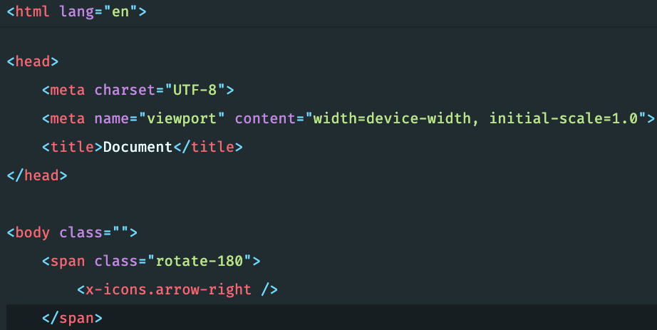

# Lazarus Resurrection Theme



A dark theme for Visual Studio Code that combines deep blues with vibrant accents for optimal code readability and visual appeal. Designed for developers who want a professional yet distinctive coding environment.

## Features

- **Deep blue background** (#182026) with **cyan text** (#88dbfd) for comfortable viewing
- **Semantic syntax highlighting** with carefully chosen colors
- **HTML/CSS optimized** with distinct colors for tags, attributes, and properties
- **Balanced contrast** for reduced eye strain during long coding sessions

## Installation

1. Open VS Code extensions (Ctrl+Shift+X / Cmd+Shift+X)
2. Search for "Lazarus Resurrection Theme"
3. Click Install
4. Open Command Palette (Ctrl+Shift+P / Cmd+Shift+P)
5. Select "Preferences: Color Theme"
6. Choose "Lazarus Resurrection Theme"

## Color Palette

| Element               | Color     | Hex       | Sample               |
|-----------------------|-----------|-----------|----------------------|
| Background            | Deep Blue | `#182026` | ![][background]      |
| Foreground Text       | Cyan      | `#88dbfd` | ![][foreground]      |
| Keywords              | Lime      | `#c9e797` | ![][keywords]        |
| HTML Tags             | Coral     | `#ef7078` | ![][tags]            |
| HTML Attributes       | Purple    | `#c28ee4` | ![][attributes]      |
| CSS Properties        | Blue      | `#93c5fd` | ![][properties]      |
| CSS Values            | Green     | `#86efac` | ![][values]          |
| Comments              | Gray      | `#546e7a` | ![][comments]        |

[background]: https://via.placeholder.com/15/182026/000000?text=+
[foreground]: https://via.placeholder.com/15/88dbfd/000000?text=+
[keywords]: https://via.placeholder.com/15/c9e797/000000?text=+
[tags]: https://via.placeholder.com/15/ef7078/000000?text=+
[attributes]: https://via.placeholder.com/15/c28ee4/000000?text=+
[properties]: https://via.placeholder.com/15/93c5fd/000000?text=+
[values]: https://via.placeholder.com/15/86efac/000000?text=+
[comments]: https://via.placeholder.com/15/546e7a/000000?text=+

## Recommended Settings

For best experience, add these to your `settings.json`:

```json
{
  "editor.fontFamily": "'Fira Code', 'JetBrains Mono', monospace",
  "editor.fontLigatures": true,
  "editor.fontSize": 14,
  "editor.lineHeight": 24,
  "workbench.colorCustomizations": {
    "[Lazarus Resurrection Theme]": {
      "editor.lineHighlightBackground": "#1e293b80"
    }
  }
}
```

## Language Support

Optimized for:
- HTML/XML
- CSS/SCSS
- JavaScript/TypeScript
- Python
- Java
- C-family languages  
- PHP
- Markdown

## Customization

To override specific colors:

```json
{
  "workbench.colorCustomizations": {
    "[Lazarus Resurrection Theme]": {
      "editor.foreground": "#aaddff",
      "editor.selectionBackground": "#334155"
    }
  },
  "editor.tokenColorCustomizations": {
    "[Lazarus Resurrection Theme]": {
      "textMateRules": [
        {
          "scope": "entity.name.tag.html",
          "settings": {
            "foreground": "#ff9999"
          }
        }
      ]
    }
  }
}
```

## Contributing

Found an issue or have suggestions?  
[Open an issue](https://github.com/josuapsianturi/lazarus) or submit a pull request.

## License

MIT ©Josua Sianturi