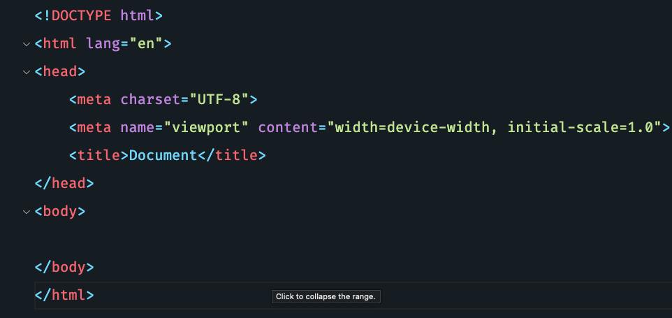

# Lazarus Vs Code Theme  
A calm, modern VS Code theme inspired by clarity and focus.

---

## Table of contents
- [Getting started](#getting-started)  
- [Installation](#installation) 
- [Override theme colors](#override-theme-colors)  
- [Recommended settings for a better experience](#recommended-settings-for-a-better-experience)

---

## Getting started  
Lazarus is a minimalist, elegant theme for Visual Studio Code that reduces distraction while improving readability and coding flow.



---

## Installation  
Launch extension Open:

- **Linux**: `Ctrl + shift + x`  
- **macOS**: `⌘ + shift + x`  
- **Windows**: `Ctrl + shift + x`  

Paste the following command and search lazarus theme press Enter:

Look for the one authored by **Josua P. Sianturi** and then install.

---

## Override theme colors  
You can fully customize the Lazarus theme by overriding specific colors using VS Code's built-in API.  
Learn more in the [Visual Studio Code Color Theme documentation](https://code.visualstudio.com/api/extension-guides/color-theme).

---

## Recommended settings for a better experience

```json
{
    // Match Lazarus line spacing
    "editor.lineHeight": 26,
    
    // Enable font ligatures for better syntax highlighting
    "editor.fontLigatures": true,

    // Clean sidebar
    "explorer.decorations.badges": false,

    // Font smoothing
    "terminal.integrated.fontWeight": "500"
}
